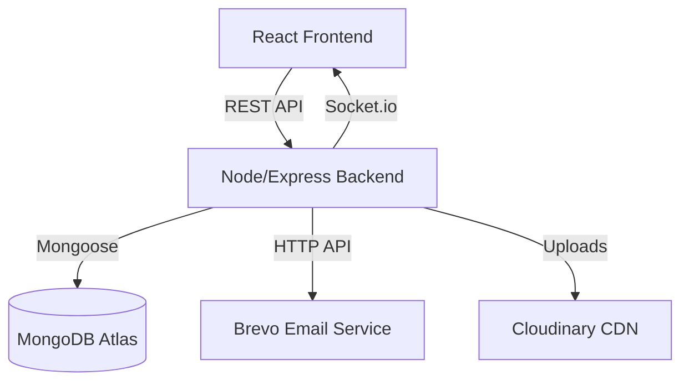

# ⚡ TicketIQ: AI-Powered Support & SLA Command Center


[](https://reactjs.org/)
[](https://nodejs.org/)
[](https://www.mongodb.com/)
[](https://tailwindcss.com/)

**TicketIQ** is a state-of-the-art, domain-adaptive customer support platform. It leverages a proprietary AI Priority Engine to automatically categorize, score, and monitor support tickets across multiple industry domains (Banking, E-commerce, Healthcare, etc.).

---

## ✨ Key Features

### 🧠 1. AI Priority Engine
Automatically assigns priority (Critical, High, Medium, Low) based on sentiment and keyword analysis specific to your business domain.

### ⏱️ 2. Real-Time SLA Monitoring
Dynamic resolution timers that track every second. Tickets are visually flagged as **"At Risk"** or **"Breached"** to ensure zero missed deadlines.

### 📊 3. High-End Admin Analytics
A data-driven dashboard featuring Neon-themed Recharts. Track ticket trends, distribution, and agent performance in real-time.

### ☁️ 4. Enterprise Infrastructure
- **Cloudinary**: Secure cloud storage for attachments.
- **Brevo API**: Bulletproof transactional emails via HTTP API (Port 443).
- **Socket.io**: Instant, live queue updates.

---

## 🏗️ Architecture



---

## 🚀 Quick Start

### 1. Prerequisites
- Node.js (v18+)
- MongoDB Atlas Account
- Cloudinary & Brevo Accounts

### 2. Installation

```bash
# Clone the repository
git clone https://github.com/Harsh-Chauhan05/TicketIQ.git

# Install Server Dependencies
cd server
npm install

# Install Client Dependencies
cd ../client
npm install
```

### 3. Environment Setup
Create a `.env` file in the **server** directory:
```env
PORT=5000
MONGO_URI=your_mongodb_uri
JWT_SECRET=your_secret
CLOUDINARY_CLOUD_NAME=...
CLOUDINARY_API_KEY=...
CLOUDINARY_API_SECRET=...
BREVO_SMTP_KEY=xkeysib-...
BREVO_SENDER_EMAIL=...
BREVO_SENDER_NAME=...
CLIENT_URL=http://localhost:5173
```

---

## 🛠️ Tech Stack
- **Frontend**: React, Tailwind CSS, Framer Motion, Recharts, Lucide Icons.
- **Backend**: Node.js, Express, Socket.io, JWT, Nodemailer (REST fallback).
- **Database**: MongoDB (Multi-tenant schema).

---

## 🤝 Connect with Me
- **LinkedIn**: [Harsh Chauhan](https://www.linkedin.com/in/harshchauhan-it)
- **GitHub**: [@Harsh-Chauhan05](https://github.com/Harsh-Chauhan05)

---
*Created with ❤️ by Harsh Chauhan*
